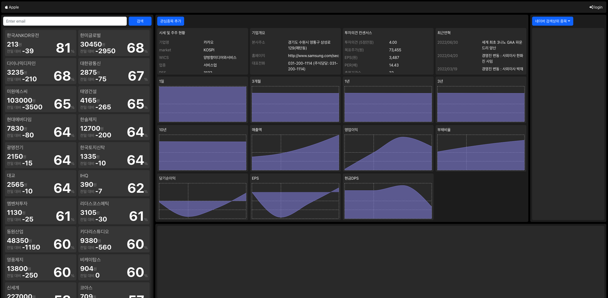

# investing-react

react 18.0.0 으로 만든 개인 프로젝트 입니다.

개발 서버: [http://113.131.145.133:3000/](http://113.131.145.133:3000/)

아래는 실제 구동 화면입니다.



---

## 프로젝트 개요

**investing-react**는 주식 데이터 분석 및 예측을 위한 개인 프로젝트로, React 18을 기반으로 프론트엔드를 구축하였습니다. 데이터는 스프링 서버에서 크롤링하며, 크롤링된 데이터는 파이썬 서버의 AI 알고리즘으로 분석하여 예측 확률을 계산합니다.

## 주요 기능

- **주식 데이터 시각화**: 다양한 UI 컴포넌트를 통해 주식 데이터, 차트, 예측 결과를 시각적으로 제공합니다.
- **AI 예측**: 파이썬 서버의 알고리즘을 활용해 주식의 향후 동향을 예측합니다.
- **Storybook 도입**: UI 컴포넌트의 독립적인 개발 및 테스트를 위해 Storybook을 사용합니다.
    - Storybook 문서, 예제, 스타일 및 데이터 연결 등 다양한 개발 편의 기능을 지원합��다.
- **모던 프론트엔드 환경**:
    - React 18, Webpack, Babel, Bootstrap 등 최신 프론트엔드 기술 스택 활용
    - 컴포넌트 기반 개발 및 관리

## 기술 스택

- **Frontend**: React 18, Bootstrap
- **UI 개발**: Storybook
- **Backend 데이터 크롤링**: Spring Framework
- **AI 분석 서버**: Python

## Storybook 안내

Storybook을 통해 다양한 UI 컴포넌트를 개발, 문서화, 테스트할 수 있습니다.  
더 자세한 정보 및 튜토리얼은 [Storybook 공식문서](https://storybook.js.org/docs)와 [GitHub 프로젝트](https://github.com/storybookjs/storybook)를 참고하세요.

## 프로젝트 실행

```bash
# 설치
npm install

# 개발 서버 실행
npm start
```

## 라이선스

본 프로젝트는 MIT 라이선스를 따릅니다.

---

주식 데이터 분석 및 예측에 관심이 있다면, 자유롭게 사용 및 기여해 주세요!